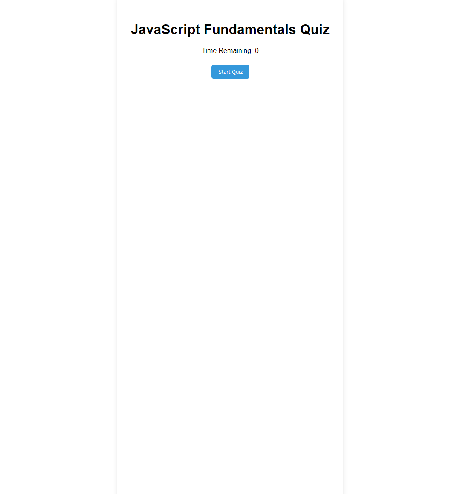
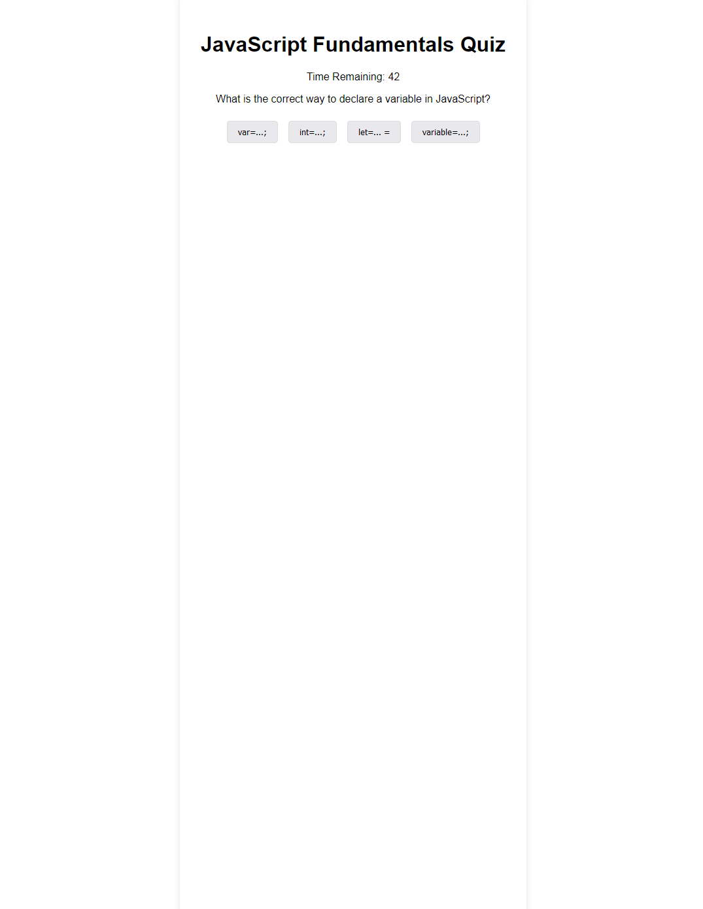

# Code-Quiz

## Description
This is a timed code quiz created by Joel John. To start the quiz click 'Start Quiz'. After the quiz ends or the timer runs down to zero you can add your initals to the highscore page. Below are demos and a link to the webpage.

## Table of Contents
- [Description](#description)
- [Preview](#preview)
- [Author](#author)
- [License](#license)

## Preview
Link to website: [CLICK ME](https://jo3kr.github.io/Code-Quiz/)

## Author
Joel John
- [GitHub](https://github.com/jo3kr)
## License
 MIT License

Copyright &copy; 2022 jo3kr &#127183;